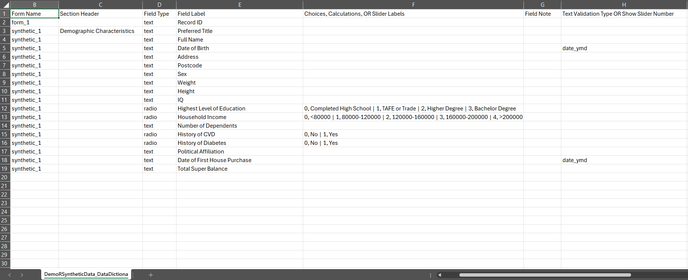

```{r, include = FALSE}
knitr::opts_chunk$set(
  collapse = TRUE,
  comment = "#>"
)
```

# Overview

```{r echo=TRUE, warning=FALSE, message=FALSE}
library(thekidsbiostats)
```

# Example Usage

The data used in the following examples are simulated using OpenAI's ChatGPT. Identifiable fields (full names, addresses, etc.) are also simulated. 

## Using Extracts (`> clean_REDCap`)

First, we can use a (.csv) extract of the data and data dictionary from REDCap:

```{r echo=TRUE}
dat_raw <- read.csv(file = "materials/miscellaneous/DemoRSyntheticData_DATA_2025-03-18_0728.csv")      # Read in the data
dict    <- read.csv(file = "materials/miscellaneous/DemoRSyntheticData_DataDictionary_2025-03-18.csv", # Read in the data dictionary
                    check.names = FALSE ## So spaces, punctuation etc. are preserved in tibble
                    ) 
```

Visualising the first few rows of our data:

```{r}
head(dat_raw, n = 10) %>%
  thekids_table(line.spacing = 0.8,
                padding = 1.5)
```

Similarly, we can visualise our standardised data dictionary extract from REDCap:

{width=100%}
<br>

Clearly:

+ Some categorical fields (`demo_income`, `demo_num_dep`, `med_hist_cvd`, `med_hist_diabetes`) are numerically coded and will need resolution before proceeding.
+ Column headers are variable names, not labels.

If we were to tabulate this data (stratifying by, say, `med_hist_cvd`), we must manually apply labels to categorical variable levels (which is indeed made easier using `thekidsbiostats::fct_case_when`) and variable names (passed directly to `tbl_summary`):

```{r echo=TRUE}
dat_raw %>%
  select(demo_postcode, anthro_sex:life_pol, life_super) %>%
  mutate(demo_edu = fct_case_when(demo_edu == 0 ~ "Completed High School",
                                  demo_edu == 1 ~ "TAFE or Trade",
                                  demo_edu == 2 ~ "Higher Degree",
                                  demo_edu == 3 ~ "Bachelor Degree"),
         demo_income = fct_case_when(demo_income == 0 ~ "<80000",
                                     demo_income == 1 ~ "80000-120000",
                                     demo_income == 2 ~ "120000-160000",
                                     demo_income == 3 ~ "160000-200000",
                                     demo_income == 4 ~ ">200000"),
         across(c(med_hist_cvd, med_hist_diabetes), ~fct_case_when(. == 0 ~ "No",
                                                                   . == 1 ~ "Yes")),
         across(c(anthro_sex, life_pol), ~case_when(. == "" ~ NA,
                                                    TRUE ~ .))) %>%
  
  tbl_summary(by = med_hist_cvd,
              type = list(demo_postcode ~ "categorical"),
              digits = list(all_categorical() ~ c(0, 1)),
              label = list(demo_postcode     ~ "Postcode",
                           anthro_sex        ~ "Sex",
                           anthro_weight     ~ "Weight",
                           anthro_height     ~ "Height",
                           assess_iq         ~ "IQ",
                           demo_edu          ~ "Highest level of education",
                           demo_income       ~ "Household income",
                           demo_num_dep      ~ "Number of dependents",
                           med_hist_diabetes ~ "History of diabetes",
                           life_pol          ~ "Political affiliation",
                           life_super        ~ "Total superannuation balance")
              ) %>%
  modify_spanning_header(all_stat_cols() ~ "**History of CVD**") %>%
  thekids_table()
```

The above code chunk is clearly quite sizeable and required a significant degree of user input. 

Instead, using `clean_REDCap`:

```{r}
dat_mod <- clean_REDCap(d = dat_raw,
             dict = dict,
             yesno_to_bool = T)

dat_mod %>%
  select(demo_postcode, anthro_sex:life_pol, life_super) %>%
  
  tbl_summary(by = med_hist_cvd,
              type = list(demo_postcode ~ "categorical"),
              digits = list(all_categorical() ~ c(0, 1))
              ) %>%
  modify_spanning_header(all_stat_cols() ~ "**History of CVD**") %>%
  thekids_table()
```

The variable levels and labels are automatically applied.


## Using APIs
