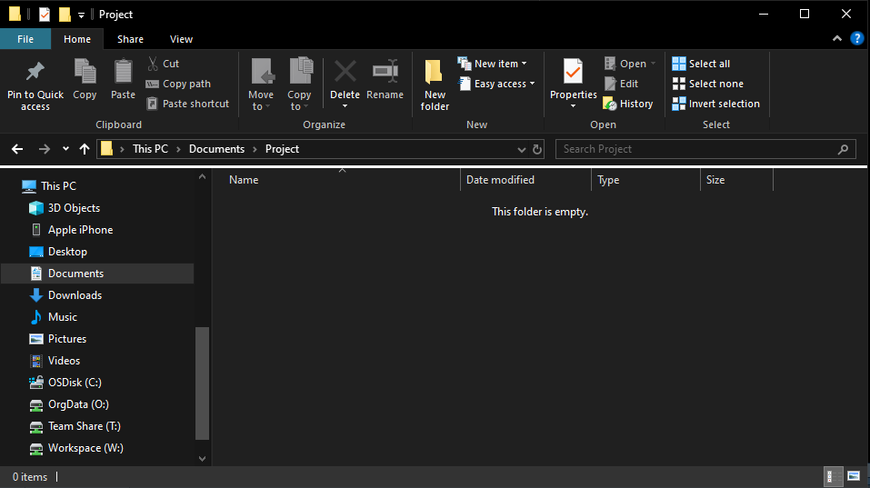
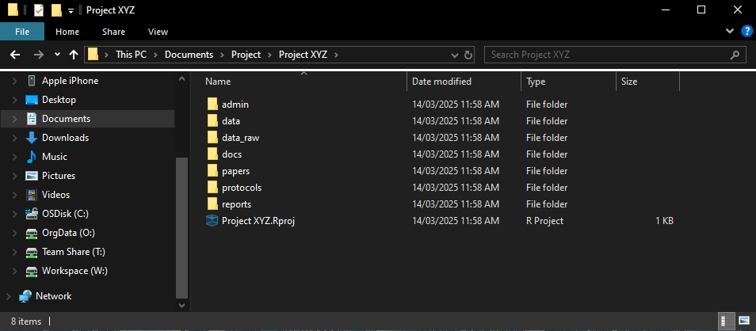
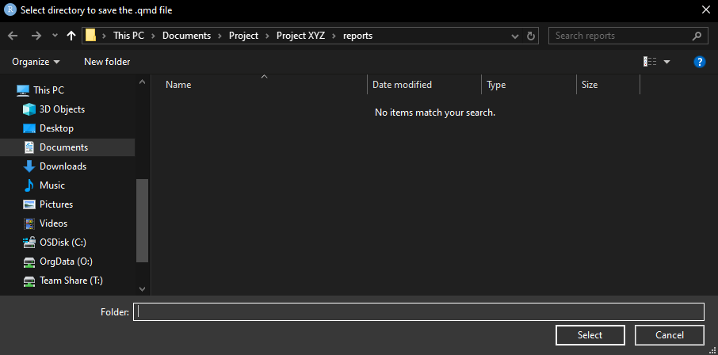
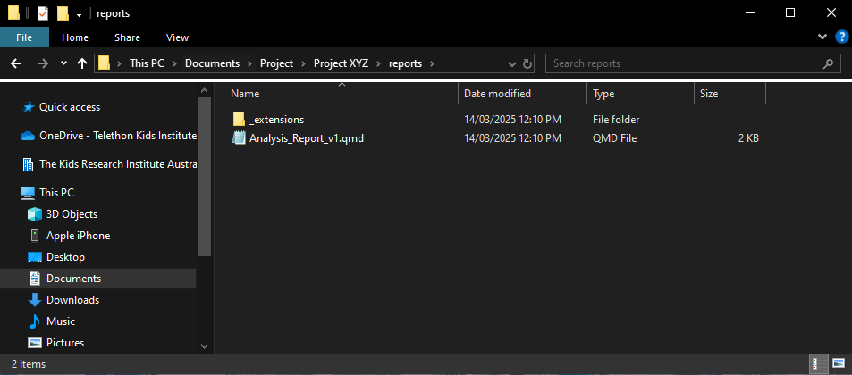
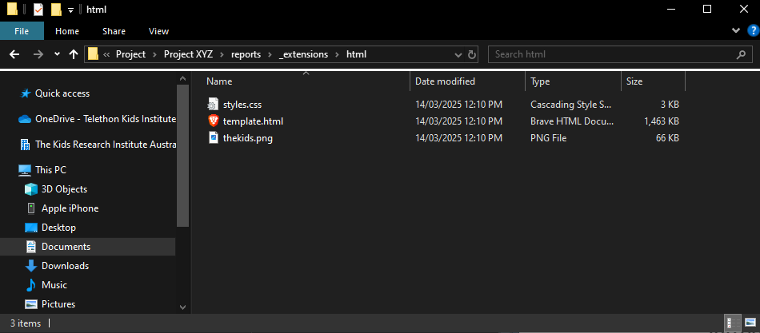
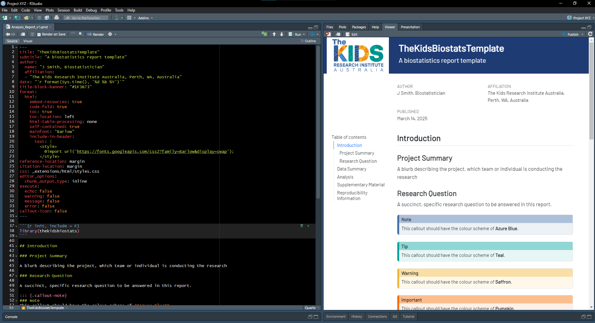

```{r, include = FALSE}
knitr::opts_chunk$set(
  collapse = TRUE,
  comment = "#>"
)

```

# Overview

```{r echo=TRUE, message=FALSE, warning=FALSE}
library(thekidsbiostats)
```

## Organising Statistical Workflows
The following section runs through the various functions for automating and/or simplifying regular/routine tasks performed through a project's workflow. These functions allow you to create a sensible/structured directory for your project as well as simplifying (and standardising) the creation of Quarto templates using The Kids theming.

## Step 1: Create folder structure

+ Let's create the following project:
  + Project is called "Project XYZ".
  + Set `ext_name = "basic"`, as I will not be leveraging Targets in this project.
  + I would like all "default" folders (i.e. admin, data, data_raw, docs, reports).
  + In addition to the above, I would like custom folders for "protocols" and "papers".

```{r echo=TRUE, eval=FALSE}
create_project(project_name = "Project XYZ", 
               ext_name = "basic",
               other_folders = c("protocols", "papers"))
```

{width=100%}


<br><br>

{width=100%}


## Step 2: Create (Quarto) markdown template
Quarto documents are versatile, reproducible file formats that supports Markdown and code chunks, enabling seamless blending of text, code, and outputs for reports, presentations, and interactive documents.

In this case, we would like to name the report "Analysis_Report_v1".

```{r echo=TRUE, message=T, eval=FALSE}
create_template(file_name = "Analysis_Report_v1",
                ext_name = "html")
```

{width=100%}


<br><br>

{width=100%}


<br><br>

{width=100%}


<br><br>

{width=100%}

<br><br>

# Enhancing Report Readbility Using Add-Ins 

## Reproducibility Information

```{r}
sessionInfo()
```

